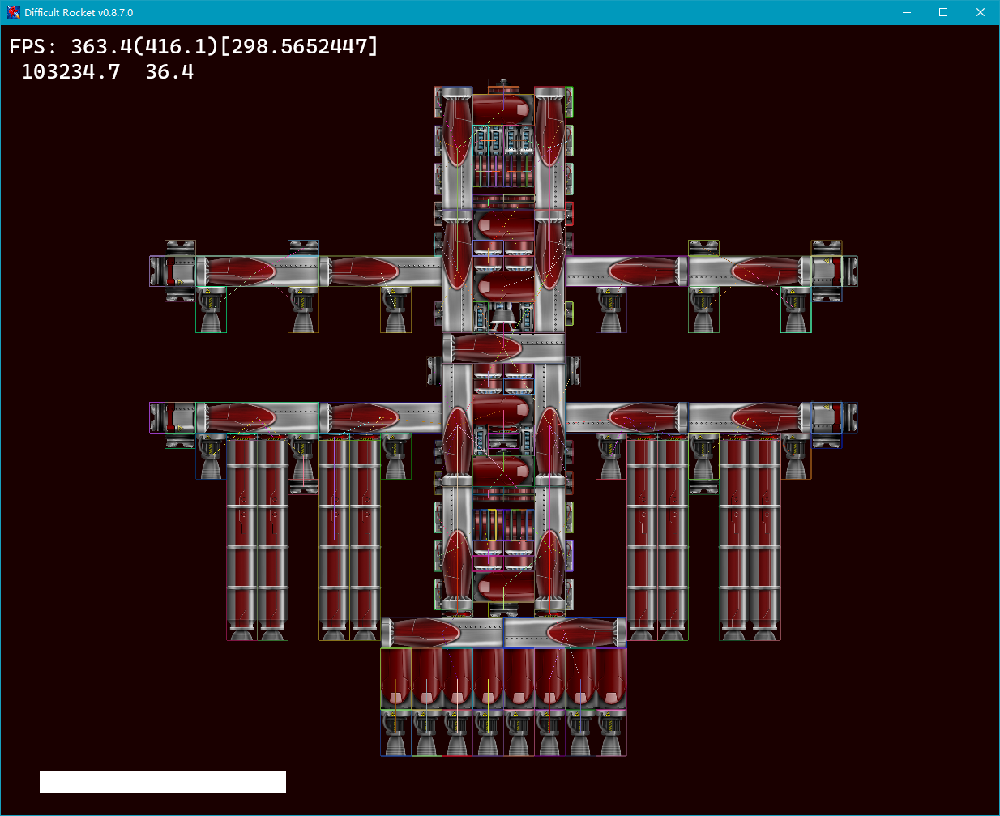

<div style="text-align: center;">

# Difficult Rocket

中文 | [English](./docs/README-en.md)

- [GitHub](https://github.com/shenjackyuanjie/Difficult-Rocket)
- [gitee](https://gitee.com/shenjackyuanjie/Difficult-Rocket)
- [discord](https://discord.gg/kWzw2JrG6M)
- [kook](https://kook.top/sRPjFG)

## 请注意 这个仓库未来只会发布 `DR SDK` 的更新 `DR game` 的更新会在 [这里](https://github.com/shenjackyuanjie/DR-game) 发布



[](https://996.icu)
[](https://Semver.org/)
[](https://Python.org)
[](https://pyglet.org)
[](https://Python.org)

## 版本

[关于版本号的说明](./docs/src/version.md)

[](https://github.com/shenjackyuanjie/Difficult-Rocket/releases)
[](https://github.com/shenjackyuanjie/Difficult-Rocket/releases)
[](https://github.com/shenjackyuanjie/Difficult-Rocket/releases)

[](https://stats.deeptrain.net/repo/shenjackyuanjie/Difficult-Rocket?theme=dark)

[DR sdk 最新 Action 构建](https://nightly.link/shenjackyuanjie/Difficult-Rocket/workflows/nuitka/main)

[DR rs 最新 Action 构建](https://nightly.link/shenjackyuanjie/Difficult-Rocket/workflows/dr_rs/main)

## English README please look [here](./docs/README-en.md)

> 这是一个用Python制作的类Simple Rocket游戏(简称：火箭模拟器)

## 优势

> 相对于原版SR比较“轻量化”

## [计划特性列表](docs/src/plan_features/README.md)

[YouTrack](https://difficult-rocket.youtrack.cloud/projects/8dafd498-59c0-4ce7-9900-d9292e9ed1f0)

## [更新日志](docs/src/change_log/readme.md)

## 运行方式

### clone

```bash title="clone.sh"
mkdir DR
cd DR
git clone https://github.com/shenjackyuanjie/Difficult-Rocket.git
# 或者
git clone https://gitee.com/shenjackyuanjie/Difficult-Rocket.git
# 又或者
git clone git@github.com:shenjackyuanjie/Difficult-Rocket.git
```

### 安装依赖

```bash title="install.sh"
python -m pip install -r requirements.txt
git submodule update --init --recursive
cd libs
cd lib_not_dr
python -m pip install .
```

### 运行

```bash title="run.sh"
python DR.py
```

## 环境需求 (测试过的 / 开发平台)

- `开发平台 1 - Windows 10 x64 22H2`
  - Python `3.8.10` / `3.10.11`
    - pillow `10.0.0`
    - psutil `5.9.5`
    - rtoml `0.9.0`
    - tomlkit `0.12.1`
    - defusedxml `0.7.1`
    - objprint `0.2.2`
    - viztracer `0.15.6`
    - vizplugins `0.1.3`
    - nuitka `1.7.10`
    - ordered-set `4.1.0`
    - imageio `2.31.2`
    - wheel `0.41.2`
    - setuptools `68.1.2`
    - setuptools-rust `1.7.0`
  - `AMD R5 5600X`
  - `AMD RX 550 4G`

## 需要的 Python 模块

- `pyglet` (已经内置 V2.0.8 路径：`./libs/pyglet`)
- `xmltodict` (已经内置 V0.12.0 路径:`./libs/xmltodict`)
- `pyperclip` (已经内置 V1.8.2 路径: `./libs/pyperclip`)

```text
# this requirement is for
#   DR basic running from source
#   DR build (by nuitka)
#   DR contributing

# for images
# not for pypy >= 3.10
pillow >= 10.0.0; (platform_python_implementation == "PyPy" and python_version < "3.10") or platform_python_implementation == "CPython"

# for sys info
psutil >= 5.9.5

# for files
rtoml >= 0.9.0
tomlkit >= 0.11.8
defusedxml >= 0.7.1

# for debug
objprint >= 0.2.2
viztracer >= 0.15.6; platform_python_implementation != "PyPy"
vizplugins >= 0.1.3; platform_python_implementation != "PyPy"

# for compile
nuitka >= 1.7.5
ordered-set >= 4.1.0
imageio >= 2.31.0; (platform_python_implementation == "PyPy" and python_version < "3.10") or platform_python_implementation == "CPython"
wheel >= 0.40.0
setuptools >= 67.8.0
setuptools-rust >= 1.6.0

```

## 感谢

- 开源项目
  - [pyglet](https://github.com/pyglet/pyglet) : GUI 和画面渲染
  - `tomlkit` / `rtoml` : toml 解析器
  - `xmltodict`: xml 与 dict 转换器
  - `pyperclip`: 剪贴板!
  - [rapier2d](https://rapier.rs/) : 物理模拟引擎
  - [pyo3](https://pyo3.rs/main): Rust Python 扩展

- 主要贡献者
  - [@Rayawa](https://github.com/Rayawa) : 文档矫正 & 翻译部分 lang
  - [@rouxiao-you](https://github.com/ruoxiao-you) : 翻译 lang
  - [@Billchyi](https://github.com/Billchyi) : 文档矫正
  - [@MSDNicrosoft](https://github.com/MSDNicrosoft) : 优化代码

</div>

## 相关链接

## 关于分享协议

#### https://creativecommons.org/licenses/by-nc-sa/4.0/

#### 署名-非商业性使用-相同方式共享 4.0 国际 (CC BY-NC-SA 4.0)

这是一份普通人可以理解的许可协议概要 (但不是替代) 。 免责声明.

您可以自由地：

共享 — 在任何媒介以任何形式复制、发行本作品

演绎 — 修改、转换或以本作品为基础进行创作

只要你遵守许可协议条款，许可人就无法收回你的这些权利。

惟须遵守下列条件：

署名 — 您必须给出地当的署名，提供指向本许可协议的链接，同时标明是否（对原始作品）作了修改。您可以用任何合理的方式来署名，但是不得以任何方式暗示许可人为您或您的使用背书。

非商业性使用 — 您不得将本作品用于商业目的。

相同方式共享 — 如果您再混合、转换或者基于本作品进行创作，您必须基于与原先许可协议地同的许可协议 分发您贡献的作品。

没有附加限制 — 您不得适用法律术语或者 技术措施 从而限制其他人做许可协议允许的事情。

声明：

您不必因为公共领域的作品要素而遵守许可协议，或者您的使用被可适用的 例外或限制所允许。

不提供担保。许可协议可能不会给与您意图使用的所必须的所有许可。例如，其他权利比如形象权、隐私权或人格权可能限制您如何使用作品。
