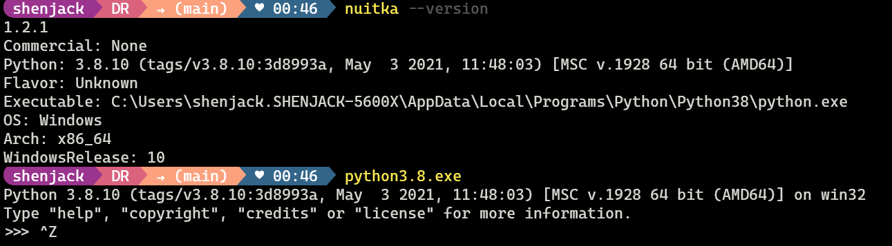
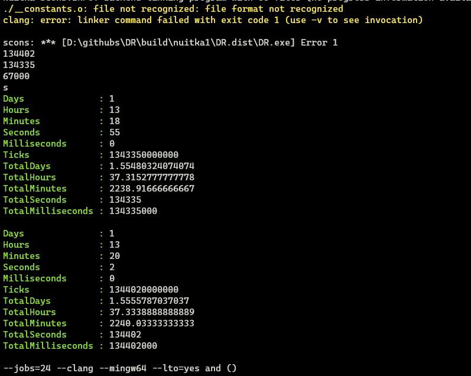
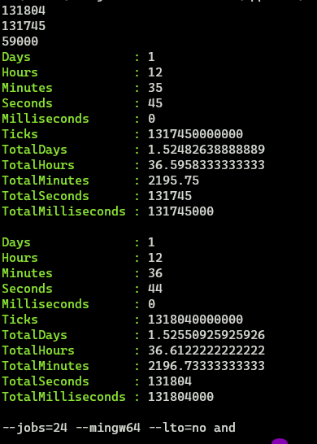

# nuitka 1.2.1 的性能测试
大家好！ 这里是shenjack！
这篇文章就是 [B站](https://www.bilibili.com/read/cv20208726) 专栏的原文！

# 综述

## 环境

- 硬件
  - CPU: `AMD R5 5600X`
  - 内存: `64G DDR4 3200 (32×2)`


- 软件
  - 
  - 
  - 
  - `gcc 12.2.0`
  - `clang 14.0.6`
  - `nuitka v1.2.1`
  - `Python 3.8.10`
  - [DR](https://github.com/shenjackyuanjie/Difficult-Rocket) commit `e6a2b7b36cc98e508efbc61c4646181f5817fc7c`

## 编译选项

- 核心编译选项
  - 环境
    - `--standalone`
      - 将环境一并打包进完成的文件夹中
      - ```
        --standalone Enable standalone mode for output. This allows you to
                     transfer the created binary to other machines without
                     it using an existing Python installation. This also
                     means it will become big. It implies these option: "--
                     follow-imports" and "--python-flag=no_site". Defaults
                     to off.```

  - 编译器
    
    - `--clang`
      - 强制使用 `clang` 编译器
      - ```
        --clang Enforce the use of clang. On Windows this requires a
                working Visual Studio version to piggy back on.
                Defaults to off.```

    - `--mingw64` (常量)
      - 强制使用 `mingw64` 编译器
      - ```
        --mingw64 Enforce the use of MinGW64 on Windows. Defaults to
                  off.```

    - `--jobs=24` (常量)
      - 最多同时运行的 C 编译器 `(clang|mingw64)` 数量
      - ```
         -j N, --jobs=N Specify the allowed number of parallel C compiler
                        jobs. Defaults to the system CPU count.```

    - `--lto=` `yes|no|auto(None)`
      - 是否启用 链接
      - ```
        --lto=choice Use link time optimizations (MSVC, gcc, clang).
                      Allowed values are "yes", "no", and "auto" (when it's
                      known to work). Defaults to "auto".```

    - `--disable-ccache`
      - 不使用 `ccache` 或者 `clcache` 的缓存
      - ```
        --disable-ccache Do not attempt to use ccache (gcc, clang, etc.) or
                         clcache (MSVC, clangcl).```


## 结论综述

补充：`lto=yes` 的情况下经常有报错

### 有 `Ccache` (全 hit 无实际编译)

`clang lto=no` 效率最高

`mingw lto=no` 效率低于 `lto=yes`，但是更加稳定（不会报错）

### 无 `Ccache` (测试编译器实际效率)

`clang lto=no` 效率最高

`mingw lto=no` 同样效率相对高

### 总结

尽量使用 `lto=no` 配合 `ccache` 以及 `clang`


# 原始数据

## 因为视频使用CPU编码，所以很多数据没法看到，这里使用的是后面再次测试/微信群内存档的数据
## 视频应该会再次测试，数据可能不同，请谅解(obs更新完没注意编码啊啊啊啊)

<table>
  <tr>
    <th>编译器</th> <th colspan="2">有ccache</th> <th colspan="2">无ccache</th>
  </tr>
  <tr>
    <th>编译器</th> <th>lto=no</th> <th>lto=yes</th> <th>lto=no</th> <th>lto=yes</th>
  </tr>
  <tr>
    <td>clang</td> <td>50s</td> <td>86s</td> <td>83s</td> <td>67s</td>
  </tr>
  <tr>
    <td>gcc</td> <td>59s</td> <td>641s</td> <td>227s</td> <td>630s</td>
  </tr>
</table>


- `clang`

  - `with ccache`

    - `lto=no`

      - `视频内数据`
      - `--clang` 
      - `--mingw64`
      - `--lto=no`
      - 耗时: 50000ms (50s)
      - 

    - `lto=yes`
    
      - `后期测试数据`
      - `--clang` 
      - `--mingw64`
      - `--lto=yes`
      - 耗时 86000ms (86s)
      - 
  
  - `no ccache`
    
    - `lto=no`
      
      - `视频内数据`
      - `--clang`
      - `--mingw64`
      - `--lto=no`
      - `--disable-ccache`
      - 耗时 83000ms (83s)
      - 
      
    - `lto=yes`
      
      - `后期测试数据`
      - `--clang`
      - `--mingw64`
      - `--lto=yes`
      - `--disable-ccache`
      - 耗时 67000ms (67s)
      - 

- `mingw64`

  - `with ccache`
  
    - `lto=no`
    
      - `后期测试数据`
      - `--mingw64`
      - `--lto=no`
      - 耗时 59000ms (59s)
      - 

    - `lto=yes`
      
      - `后期测试数据`
      - `--mingw64`
      - `--lto=yes`
      - 耗时 641000ms (641s) (10.68min)
      - 
  
  - `no ccache`
  
    - `lto=no`
    
      - `视频内数据`
      - `--mingw64`
      - `--lto=no`
      - `--disable-ccache`
      - 耗时 227000ms (227s) (3.78min)
      - 

    - `lto=yes`
      
      - `后期测试数据`
      - `--mingw64`
      - `--lto=yes`
      - `--disable-ccache`
      - 耗时 630000ms (630s) (10.5min)
      - 